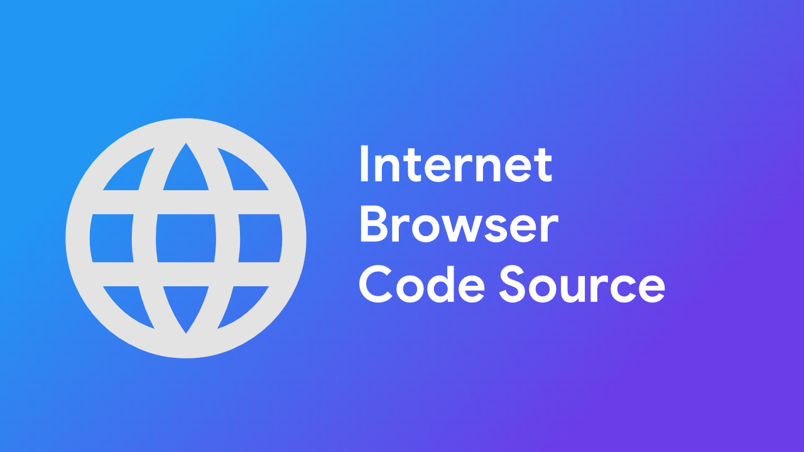

# Internet Browser (Android)

  
[]

A free, open-source, privacy-focused, and AI-powered web browser for Android.  
Inspired by FOSS browser projects and enhanced with intelligent AI features for a smarter, safer browsing experience.

---

## Overview

**Internet Browser** is designed to be lightweight, fast, and respectful of user privacy.  
It combines essential modern browser features with built-in AI tools to help users understand and interact with web content more efficiently.

---

## Features

- **Free & Open Source**  
  Fully open-source and licensed under the MIT License.

- **Privacy-Focused**  
  - Blocks trackers and ads  
  - No user data collection  
  - No analytics or telemetry

- **Fast & Lightweight**  
  - Built on Android WebView  
  - Spoofed User-Agent for improved website compatibility

- **AI-Powered Tools**  
  - **AI Chat:** Ask questions directly inside the browser  
  - **AI Explain:** Summarize articles, explain web pages, and clarify content

- **Tab Support**  
  Browse multiple websites simultaneously.

- **Dark Mode**  
  Built-in dark theme for comfortable low-light browsing.

- **Download Manager**  
  Download files with Android's Download UI

---

## Screenshots

  
  

---

## Installation

> **Note:** Installation instructions will be updated as releases become available.

- Clone the repository and build using Android Studio  
- Or download the APK from the Releases page *(when available)*

---

## Roadmap

- Improved AI features  
- Enhanced tab management  
- Better ad & tracker blocking  
- UI/UX improvements  
- Performance optimizations

---

## Contributing

Contributions are welcome!  
Feel free to open issues, submit pull requests, or suggest new features.

---

## License

This project is licensed under the **MIT License**.  
See the [LICENSE](LICENSE) file for details.
